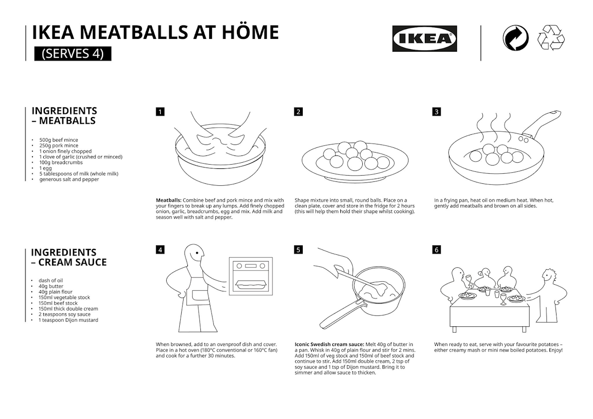

# [Ikea Meatballs](https://twitter.com/IKEAUK/status/1252269467515617280/photo/1) (untested)

* yields 4 servings (16-20 meatballs)
* released during the 2020 pandemic
* see also: [Ikea SG recipe card](https://www.ikea.com/ms/en_SG/pdf/restaurant/Meatballs_w_creamsauce.pdf)

## Ingredients - Meatballs

* 500g beef mince
* 250g pork mince
* 1 onion finely chopped
* 1 clove of garlic (crushed or minced)
* 100g breadcrumbs
* 1 egg
* 5 tablespoons of whole milk
* generous salt and pepper to taste

## Ingredients – Cream Sauce

* dash of oil
* 40g butter
* 40g plain flour
* 150ml vegetable stock
* 150ml beef stock
* 150ml thick double cream
* 2 teaspoons soy sauce
* 1 teaspoon Dijon mustard

Directions

1. **Meatballs**:
   Combine beef and pork mince and mix with your fingers to break up any lumps.
   Add finely chopped onion, garlic, breadcrumbs, egg and mix.
   Add milk and season well with salt and pepper.
2. Shape mixture into small, round balls.
   Place on a clean plate, cover and store in the fridge for 2 hours
   (this will help them hold their shape whilst cooking).
3. In a frying pan, heat oil on medium heat.
   When hot, gently add meatballs and brown on all sides.
4. When browned, add to an ovenproof dish and cover.
   Place in a hot oven (180°C conventional or 160°C fan) and cook for a further 30 minutes.
5. **Iconic Swedish cream sauce**:
   Melt 40g of butter in a pan.
   Whisk in 40g of plain flour and stir for 2 mins.
   Add 150ml of veg stock and 150ml of beef stock and continue to stir.
   Add 150ml double cream, 2 tsp of soy sauce and 1 tsp of Dijon mustard.
   Bring it to simmer and allow sauce to thicken.
6. When ready to eat, serve with your favourite potatoes - either creamy mash or mini new boiled potatoes.
   Enjoy!

---

Source:

