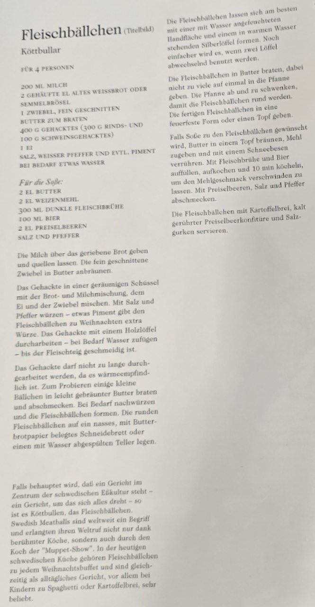

found in Die schwedische Küche in ikea, translated by llm

---

Here is the English translation of the recipe:

The meatballs are best shaped with a hand moistened with water and a silver spoon dipped in warm water. It's even easier
if two spoons are used alternately.

Fry the meatballs in butter, taking care not to put too many in the pan at once. Swirl the pan now and then so that the
meatballs become round. Place the finished meatballs in an ovenproof dish or a pot.

If sauce is desired with the meatballs, brown butter in a pot, add flour, and stir with a whisk. Add beef broth and
beer, bring to a boil, and simmer for 10 minutes to let the flour taste disappear. Season to taste with lingonberries,
salt, and pepper.

Serve the meatballs with mashed potatoes, cold-stirred lingonberry jam, and salted pickles.

***

### **Meatballs** (Cover picture)

### **Köttbullar**

**FOR 4 PEOPLE**

**200 ML MILK**
**2 HEAPING TBSP OLD WHITE BREAD OR BREADCRUMBS**
**1 ONION, FINELY CHOPPED**
**BUTTER FOR FRYING**
**400 G MINCED MEAT (300 G BEEF AND 100 G PORK)**
**1 EGG**
**SALT, WHITE PEPPER AND POSSIBLY ALLSPICE**
**A LITTLE WATER IF NEEDED**

***For the sauce:***
**2 TBSP BUTTER**
**2 TBSP WHEAT FLOUR**
**300 ML DARK BEEF BROTH**
**100 ML BEER**
**2 TBSP LINGONBERRIES**
**SALT AND PEPPER**

Pour the milk over the grated bread and let it soak. Sauté the finely chopped onion in butter until browned.

In a spacious bowl, combine the minced meat with the bread and milk mixture, the egg, and the onion.
Season with salt and pepper – a little allspice gives the meatballs an extra festive touch for Christmas.
Work the mixture with a wooden spoon – adding water if necessary – until the meat dough is smooth.

The minced meat should not be overworked, as it is sensitive to heat.
To test, fry a few small meatballs in lightly browned butter and taste.
Season more if necessary and then form the meatballs.
Place the round meatballs on a wet cutting board lined with buttered paper or on a plate rinsed with water.

***

If it is claimed that one dish is at the center of Swedish food culture – a dish around which everything revolves – it
is Köttbullar, the meatball. Swedish meatballs are known worldwide and gained their global reputation not only thanks to
famous chefs but also through the chef from the "Muppet Show". In today's Swedish cuisine, meatballs are part of every
Christmas buffet and are also an everyday dish, especially popular with children served with spaghetti or mashed
potatoes.