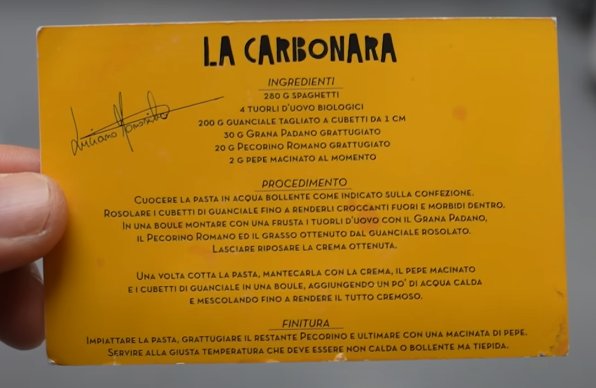

# La Carbonara

* https://www.tasteatlas.com/carbonara/recipe/luciano-monosilios-carbonara---carbonara-by-romes-carbonara-king
* https://www.youtube.com/watch?v=ZCSowIQgHPI
* https://www.youtube.com/watch?v=90LalTBSIhE
* similar: https://www.seriouseats.com/pasta-carbonara-sauce-recipe

This recipe is adapted from the recipe card Luciano Monosilio gives in his restaurant Luciano - Cucina Italiana with
each order of carbonara. Still, it is also based on our in-house research. Luciano's carbonara is made with a mixture of
pecorino Romano and Grana Padano, which is added to reduce the overall saltiness of the dish. The sauce is thickened in
a bain-marie, so the eggs are cooked but not scrambled, and the sauce is thick and creamy.

yields 4 servings

## INGREDIENTS

* 280g dry spaghettoni, monograno brand
* 4 egg yolks
* 200g guanciale, cured for at least 4 months
* 30g Grana Padano, grated
* 20g Pecorino Romano, grated
* 2g pepper, freshly ground

## DIRECTIONS

1. Guanciale
    1. Cut off the rind and the pepper layer. Discard or store for another use. It should be about 1.5 cm thick.
    2. Slice the guanciale into 1 cm slices, stack them, and cut into 1 x 1.5 x 1.5 cm cuboids.
    3. Add the guanciale to a dry pan (no oil or butter), and sauté over high heat until just browned.
    4. Once it browns (and may be smoking), lower the heat so it cooks inside but does not burn.
    5. Let it braise in its fat until crispy on the outside and soft on the inside.
    6. When the guanciale is done, drain the rendered fat into a separate heatproof bowl.
    7. Allow both the fat and the guanciale cool to room temperature.
2. Pasta
    1. Cook the spaghetti according to package directions minus 2 minutes, just shy of al dente.
    2. Use less salt in the water, maybe just a pinch, as the rest of the recipe is already salty.
    3. Use less water, as the starchy water is important for the sauce.
    4. Sir constantly as it cooks.
3. Sauce
    1. Whisk the egg yolks and cheese in a large metal bowl.
    2. Continue whisking over a bain marie while adding half a cup of pasta water, like making a sabayon.
    3. *Gradually adding hot pasta water may be an alternative to using a bain marie, as it tempers the eggs.*
    4. Slowly pour in the drained fat from the guanciale and continue whisking, as if making hollandaise/bearnaise.
    5. You might not use up all the fat. Don't break the emulsion.
    6. *Possible optimization: use the pasta pot as a bain marie, reducing necessary pots by one.*
4. Putting it all together
    1. Add pasta and swirl to combine with the sauce.
    2. Add guanciale and toss to combine
5. Serving
    1. Twirl in a ladle with a pair of chopsticks, then transfer to a bowl.
    2. Use the ladle to scoop over the guanciale and sauce.
    3. Sprinkle additional pecorino Romano over the top.
    4. Sprinkle each portion of carbonara generously with freshly ground pepper.
    5. Serve immediately, or the sauce will dry out and become sticky.

---

COOKING TIPS

* How To Avoid Turning Carbonara Sauce Into Scrambled Eggs
    * For the perfect carbonara sauce, temperature control is crucial. Because eggs curdle once the temperature exceeds
      65°C/150°F, most recipes instruct that the pasta be taken off the flame before adding beaten eggs. When making
      carbonara, beaten egg yolks are to be tempered, which means you need to raise the temperature of the yolks
      gradually, and essentially cook them without scrambling them. Tempered eggs are used in various sauces as a
      binding agent or thickener, and even though they might look raw, they are actually perfectly cooked.
* Method
    * A more traditional approach is to combine drained pasta, eggs, and guanciale in a pot where pasta was cooked, then
      stir the ingredients over low heat until pasta gets coated with a creamy sauce, which may need loosening with a
      bit of cooking water. However, it seems that the traditional approach may yield unsatisfactory results, which is
      why it's often recommended to mix the carbonara sauce over a double broiler or even mix it with the hot pasta in a
      large bowl allowing the heat of the pasta to cook it.
* Eggs
    * Although traditionally, carbonara is prepared with egg yolks only, many recipes use whole eggs or a combination of
      eggs and yolks. The number of egg yolks/eggs used is also a matter of debate, as recipes vary from 2 eggs per six
      servings to four yolks/eggs for four servings. Also, to get an extra rich sauce, some recipes call for adding one
      egg for every 4 egg yolks.
* Egg Yolks Or Eggs
    * Although today it's been widely established that carbonara is prepared with egg yolks, there are also claims that
      making carbonara with whole eggs is also traditional.
* How Much Guanciale
    * The amount of guanciale varies from recipe to recipe. Some call for merely 25g (0.9 oz) per serving, while others
      call for anywhere from 50g (1.75 oz) to 100 (3.5 oz) per serving.
* How To Cut The Guanciale
    * Guanciale can be cut either into strips or into dices. Cutting guanciale into strips makes for a crispier,
      crunchier guanciale once browned, especially if it's cut very thin, while cutting guanciale into dices will
      produce guanciale that is crisp on the outside but soft on the inside, meaning the upon biting into one, the fat
      on the inside would explode in one's mouth.
* Browning Guanciale
    * Guanciale is to be sautéed over low heat, and no fats or oils should be added to the pan beforehand. The excess
      rendered fat can be removed, if desired, by soaking it up with a paper towel or by draining the guanciale and
      discarding the fat. If the fat and the guanciale burns, it should not be used but thrown away, and a new batch
      should be fried.
* Guanciale Substitutes
    * If not available, guanciale or cured pork jowl can be substituted with Italian pancetta (unsmoked) or even bacon,
      preferably of higher quality. However, while browning guanciale doesn't really require using extra fat, pancetta
      and bacon are often browned in lard or olive oil, while some recipes opt for butter. In any case, guanciale, or
      its substitutes, should be fried over medium heat, until lightly browned and rendered.
* Cheese
    * Traditionally, the best cheese is Italian pecorino (sheep cheese), preferably the Pecorino Romano variety, but it
      can be partially or entirely substituted with Parmigiano-Reggiano. However, this will make for a much saltier
      carbonara sauce, especially if combined with pancetta or bacon, so take note and cut back on the salt when cooking
      pasta. Also, because Pecorino Romano cheese is a hard-melting cheese, it's crucial that it's grated finely in
      order to advance its melting properties.
* Pasta
    * Spaghetti may be the standard choice of pasta, but other types of pasta like fettuccine, rigatoni, bucatini,
      macherroni, and penne also work well with the carbonara sauce.
* Cooking The Pasta
    * Even though Italians say that the water for cooking pasta should be salty as the Mediterranean when preparing
      spaghetti alla carbonara, this rule should not be followed to a tee, as both guanciale and Pecorino Romano cheese
      provide sufficient saltiness. Also, since starchy water in which the pasta was cooked adds to the creaminess of
      the sauce, halving the amount of water typically used to boil pasta will produce an ultra-starchy leftover liquid,
      which is one of the secrets to a velvety-smooth carbonara sauce. Because pasta will continue to cook with the
      sauce, it should not be completely cooked but be taken out of the water just shy of al dente. Also, when done, it
      should not be well-drained but instead should be taken out of the water with pliers, as residual starch liquid
      improves the creaminess of the sauce.
* Cream
    * Using cream is strictly forbidden and known as the biggest mistake in making spaghetti alla carbonara. The cream
      is heavy and cloying, especially when reduced, and adding it to carbonara turns this delicate pasta sauce into a
      thick sludge. However, some chefs like to add it because it expands the amount of time the carbonara sauce stays
      creamy — carbonara, when made traditionally, turns dry quickly and needs to be served right away, before that
      happens.
* Additional Ingredients
    * In modern iterations of the recipe, garlic is often used, but only to infuse the oil; it is disposed of afterward.
      According to some chefs, a splash of white wine is a welcomed addition, as are onions, while some like to add a
      pop of color in the form of roughly chopped parsley.
* Serving
    * While preparing spaghetti alla carbonara, it is recommended to warm the serving bowls/plates, as this will keep
      the carbonara sauce creamy for longer. Also, carbonara should be served right after it's been prepared, as the
      sauce turns dry very quickly.